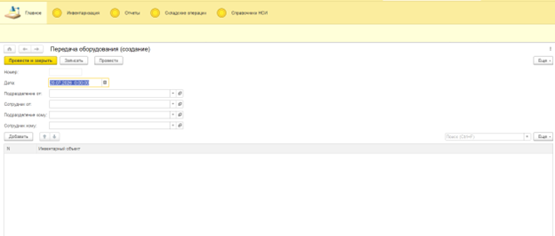
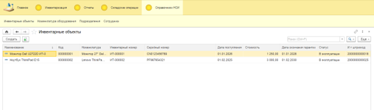
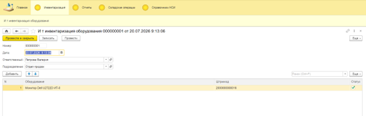

# Подсистема учета и движения ИТ-оборудования (1С:Предприятие 8.3)

## Описание проекта

Проект представляет собой готовую конфигурацию с автономным **Расширением**, предназначенную для автоматизации сквозного учета ИТ-активов, оргтехники и офисного оборудования в коммерческих организациях.

**Бизнес-ценность решения:**
Обеспечивает полный жизненный цикл оборудования (от закупки до утилизации), исключает утерю материальных ценностей за счет жесткого контроля остатков и персональной ответственности сотрудников, а также предоставляет руководству оперативную аналитику по ИТ-инфраструктуре компании.

---

## Архитектура и технические решения

При проектировании конфигурации основной упор был сделан на оптимальное использование ресурсов платформы, транзакционную безопасность и чистоту кода.

### 1. Схема данных и метаданные

* **Справочники:**
  * `Номенклатура оборудования` — иерархический классификатор (типы устройств, модели, характеристики).
  * `Инвентарные объекты` — подчинен номенклатуре. Хранит уникальные серийные/инвентарные номера конкретных физических единиц техники.
  * `Сотрудники`, `Подразделения` — аналитические разрезы учета.

* **Регистры накопления:**
  * `Остатки оборудования` (Тип: **Остатки**). Хранит актуальные данные в разрезе: *Подразделение*, *Сотрудник*, *Номенклатура*, *ИнвентарныйНомер*.

### 2. Документооборот и транзакционная логика

В системе реализовано три ключевых документа, двигающих регистр остатков:
1. **Поступление оборудования:** Оприходует технику на баланс организации.
2. **Передача оборудования:** Отражает выдачу техники конкретному сотруднику с одновременным перемещением ответственности.
3. **Списание оборудования:** Отражает утилизацию или выход техники из строя.

**Технические особенности проведения:**
* Реализован **оперативный контроль остатков** при проведении документов «Передача» и «Списание». Блокировка транзакции на уровне сервера базы данных при попытке списать/передать технику, которой физически нет на балансе.
* Защита от некорректного ввода: проверка уникальности инвентарных номеров при записи документов.

### 3. Аналитическая отчетность (СКД)

Все отчеты построены на базе **Системы компоновки данных (СКД)**:
* Оптимальные запросы к виртуальным таблицам остатков (`РегистрНакопления.ОстаткиОборудования.Остатки`).
* Настройки компоновки включают гибкие группировки (по подразделениям/сотрудникам) и условное оформление.

---

## Модуль расширения: «ИТ-Штрихкодирование и Инвентаризация»

Для подсистемы разработано изолированное **Расширение конфигурации (.cfe)**, добавляющее функционал маркировки и экспресс-инвентаризации техники без изменения метаданных основной базы.

### Технические особенности расширения:
* **Заимствование и расширение метаданных:** Бесшовное добавление реквизита `Ит_Штрихкод` к заимствованному справочнику `ИнвентарныеОбъекты`.
* **Автоматизация форм (BSL):** Реализованы клиент-серверные обработчики событий формы (`ПриИзменении`), автоматически подтягивающие данные штрихкода при выборе инвентарного объекта.
* **Автозаполнение по остаткам:** Программная сборка запросов к регистру остатков для быстрого формирования ведомости инвентаризации в разрезе выбранного подразделения.
* **Имитация сканирования:** Логика поиска и мгновенной подсвети/активизации строк ТЧ по введенному штрихкоду.
* **Изолированный UI:** Создание отдельной подсистемы расширения для гибкой настройки командного интерфейса и Рабочего стола без повреждения основной структуры меню.

---

## Интерфейс системы (UX/UI)

### Рабочий стол системы

### Справочник инвентарных объектов с поддержкой штрихкодов

### Документ инвентаризации (из Расширения)

---

## Установка и развертывание

1. Скачайте файлы выгрузки из папки [`bin/`](bin/)
   или
   * `учет_оборудования_с_подсистемами.cf` — основной файл конфигурации.
   * `ИТ_штрихкодирование.cfe` — файл расширения инвентаризации.
3. Создайте пустую информационную базу на платформе **1С:Предприятие 8.3**.
4. Запустите базу в режиме **Конфигуратор**.
5. Выполните команду `Конфигурация` -> `Загрузить конфигурацию из файла...` и выберите `учет_оборудования_с_подсистемами.cf`. Нажмите `F7`.
6. Для подключения расширения перейдите в меню `Конфигурация` -> `Расширения конфигураций`, добавьте новое расширение и загрузите файл `ИТ_штрихкодирование.cfe` (снимите галочки «Безопасный режим» и «Защита от опасных действий»).
7. Запустите отладку (`F5`) для работы в режиме «1С:Предприятие».
