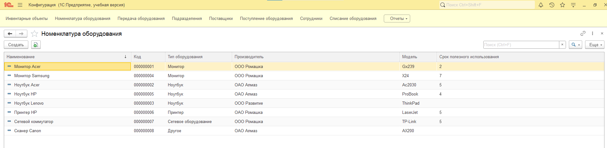

# Система учета оборудования в организации

## Описание проекта

Данный проект представляет собой учебную конфигурацию на платформе 1С:Предприятие, предназначенную для автоматизации учета оборудования в организации.

Система обеспечивает полный цикл работы с оборудованием:

* регистрация поступления,
* передача сотрудникам,
* списание оборудования,
* формирование аналитических отчетов,
* удобная навигация через рабочий стол конфигурации.

Проект разработан в целях практического освоения механизмов платформы и демонстрации навыков проектирования структуры конфигурации.

---

## Основные функциональные возможности

### 1. Учет оборудования

* хранение информации об оборудовании в справочнике;
* учет номенклатуры, инвентарных объектов и статусов;
* контроль наличия оборудования по подразделениям и сотрудникам.

### 2. Работа с поставщиками

* выбор поставщика из справочника при оформлении поступления;
* хранение контактных данных поставщиков;
* возможность дальнейшего расширения учета закупок.

### 3. Документы учета

В системе реализованы следующие документы:

* Поступление оборудования
* Передача оборудования сотруднику
* Списание оборудования

Документы формируют движения по регистру накопления и обеспечивают корректный учет остатков.

### 4. Регистры накопления

Регистр накопления используется для хранения информации о движении оборудования:

* учет остатков оборудования;
* контроль списаний;
* отслеживание оборудования по сотрудникам и подразделениям.

### 5. Отчеты

В конфигурации реализованы отчеты с улучшенной структурой и визуальным представлением данных:

* отчет по остаткам оборудования;
* оборудование по подразделениям;
* оборудование у сотрудников;
* списанное оборудование;
* группировка и отбор по полям;
* итоговые значения и аналитика.

Отчеты позволяют быстро анализировать текущее состояние оборудования в организации.

---

## Интерфейс системы

В конфигурации реализована улучшенная структура интерфейса:

* добавлена логическая группировка объектов;
* упрощена навигация по справочникам и документам;
* интерфейс адаптирован для удобства работы пользователей.

---

## Используемые объекты конфигурации

### Справочники

* Инвентарные объекты
* Номенклатура оборудования
* Поставщики
* Сотрудники
* Подразделения

### Документы

* Поступление оборудования
* Передача оборудования
* Списание оборудования

### Регистры накопления

* Остатки оборудования

### Отчеты

* Остатки оборудования
* Оборудование по подразделениям
* Оборудование по сотрудникам
* Списанное оборудование

---

## Установка и запуск

1. Открыть платформу в режиме «Конфигуратор».
2. Загрузить файл конфигурации (.cf) или выгрузку (.xml).
3. Обновить конфигурацию базы данных.
4. Запустить базу в режиме «Предприятие».

---

## Назначение проекта

Проект создан как личный учебный проект для практического освоения разработки на платформе 1С:Предприятие.

Конфигурация демонстрирует:

* работу со справочниками и документами;
* использование регистров накопления;
* разработку отчетов;
* настройку пользовательского интерфейса;
* обработку типовых бизнес-процессов учета оборудования.

---

## Возможные направления развития

* учет мест хранения оборудования;
* история перемещений оборудования;
* учет ремонтов оборудования;
* разграничение прав доступа пользователей;
* интеграция с бухгалтерским учетом;
* расширенная аналитика и графические отчеты;
* импорт и экспорт данных.

---

## Автор

Проект разработан пользователем Vera как личный учебный проект для практического освоения разработки на платформе 1С:Предприятие.

---
